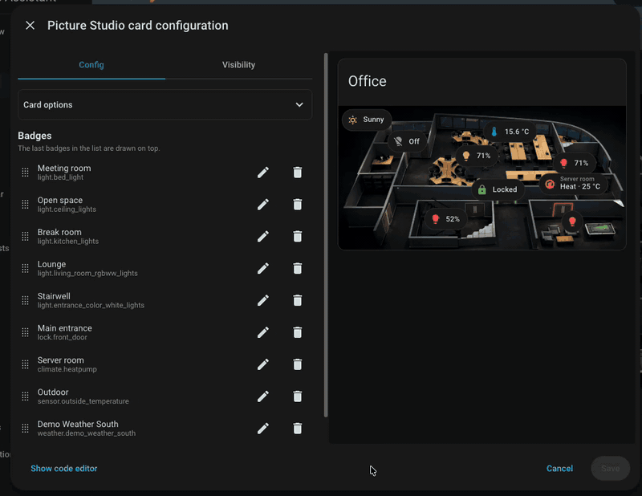
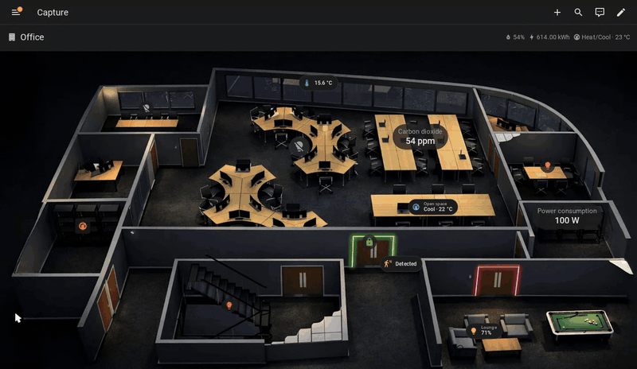

# Picture Studio

**Turn any picture into a dashboard: put your Home Assistant entities where they belong — right in the card editor, without writing a line of YAML.**

A floor plan, a photo, a camera view: pick an image, drop items on it, and place them with the mouse on the live preview. What you drag is what you get.

## The editor



## The dashboard

Once saved, what you placed behaves like anything else in Lovelace: a tap opens its more-info, unless you give it something else to do.



## What goes on the picture

Pick the kind that fits what you want to show, then place it by dragging it on the live preview — selecting an item there opens its own settings.

### Badges

A badge is Home Assistant's own — the pill you already know from the top of a dashboard view, with its icon, its state and the colour the entity gives it. On the picture it behaves exactly as it does anywhere else.

**Custom badges** count too. Badges from other frontend plugins appear in the picker next to the built-in ones and render on the image just the same.

You can set a badge's [anchor](#anchor) and its [visibility](#visibility).

### Icons

An icon is the entity's glyph and nothing else: no pill, no text, no surface unless you ask for one. It is what you want when the picture has to stay readable underneath — a lamp on a floor plan, a door, a camera. It takes the colour of the entity's state, or a colour you name.

You can set its [anchor](#anchor), its [size](#size), its [appearance](#appearance) and its [visibility](#visibility).

### Labels

A label puts text on the picture: the entity's state, its name, or both. A temperature over the room it measures, a title over an area, a countdown next to the door it belongs to.

You can set its [anchor](#anchor), its [size](#size), its [appearance](#appearance) and its [visibility](#visibility).

## Install

### Requirements

**Home Assistant 2026.6.0 or newer.** HACS enforces this and will refuse to install on an older version.

### HACS

[](https://my.home-assistant.io/redirect/hacs_repository/?owner=lalexdotcom&repository=picture-studio-card&category=plugin)

Picture Studio is **not** in the default HACS catalog, so it has to be added as a custom repository. The button above does exactly that: HACS asks you to confirm, adds the repository, and opens its page. From there:

1. Choose **Download**.
2. Reload Home Assistant.
3. Hard-refresh your browser — **Ctrl + F5** on Windows/Linux, **Cmd + Shift + R** on Mac.

<details>
<summary>If the button does not work</summary>

HACS may not be installed yet, or your instance URL may not be registered with My Home Assistant. Add the repository by hand:

1. Open **HACS** in Home Assistant.
2. Open the **⋮** menu → **Custom repositories**.
3. Repository: `lalexdotcom/picture-studio-card` — Type: **Dashboard**.
4. **Add**, then open **Picture Studio** from the list, and download it as above.

One other case needs a manual step: a dashboard in YAML mode, where HACS cannot touch the resource list and says so. Add the resource yourself as described under **Manual install**, with `/hacsfiles/picture-studio-card/picture-studio.js` as the URL.

</details>

<details>
<summary>Manual install</summary>

1. Download `picture-studio.js` from the [latest release](https://github.com/lalexdotcom/picture-studio-card/releases/latest).
2. Copy it into your Home Assistant `www` directory — `config/www/picture-studio.js`. Create `www` if it does not exist.
3. Add it as a dashboard resource, in **Settings → Dashboards → ⋮ → Resources → Add resource**:
   ```yaml
   url: /local/picture-studio.js
   type: module
   ```
   In YAML mode, put the same two keys under `lovelace: resources:` in `configuration.yaml` instead.
4. Reload Home Assistant, then hard-refresh your browser.

Updating means repeating steps 1 and 2, then hard-refreshing. Appending a query string to the resource URL — `/local/picture-studio.js?v=2` — is the reliable way to defeat browser caching.

</details>

### Add the card

1. Edit your dashboard.
2. **Add card**.
3. Search for **Picture Studio**.
4. Pick the background image.
5. Add badges, icons or labels, then drag them onto the image in the preview.
6. **Save**.

## Card configuration

### Background

The picture comes from one of three places, and the editor's **Background**
section holds all three: a **path** you type — `/local/floorplan.png` — a file
you drop on the field or pick from your media library, or an **entity**. An
`image` entity draws whatever it currently holds; a **camera** draws its
snapshot, or its live stream if you ask for **Live** instead of **Auto**.

Around it:

- **Dark mode image** — a second picture, used when your dashboard is dark.
  Without one, the same picture serves both.
- **Aspect ratio** — `16:9`, `1:1`, `56.25%`. The card is as tall as the
  picture unless you say otherwise.
- **Filters** — a CSS filter over the picture, and a second one for dark mode:
  `brightness(0.7)`, `grayscale(1)`, anything `filter:` accepts. The editor
  keeps them in their own **Filters** section.
- **Entity** — name one in the editor's own **Entity** section, and the picture
  follows its state: greyed while the entity is off or unavailable, which is
  Home Assistant's own behaviour for a state-driven image. With **state images**
  or **state filters** you go further and map each state to its own picture or
  its own filter.

The card sizes itself to the image by default. If you resize it to a height the
image does not fit — in the edit dialog's **Layout** tab, not this form — the
image keeps its proportions, and the part that no longer fits stays reachable by
scrolling the card.

### Heading

The card can carry a header above the picture: a **title**, an **icon**, and
**badges** — Home Assistant's own heading badges, the ones a view's heading card
uses, with the same picker and the same forms. All three are optional and a card
without them starts straight at the picture.

## Item configuration

### Size and position

#### Anchor

An item's position is a pair of percentages, and the anchor decides which part of
the item they place.

- **Automatic** *(default)* — the anchor follows the coordinate.
- **Anchored** — the coordinates place the point you pick in the grid.

#### Size

An item's size follows the **card**, not the screen: in a sections view a narrow
column gives a smaller item than a wide one, and the same card on a phone scales
down with it. Three modes decide how closely:

- **Automatic** *(default)*
- **Adaptive** — your own ratio, between your own bounds.
- **Fixed** — one size in pixels, which follows nothing.

An icon's size is the box that contains it. A label's size is its font size —
the box is as wide as the text.

### Appearance

**Stand out** draws a halo and a rim to make the item pop off the picture.

A **chrome** surrounds an item with its own surface.

- **Theme** — **Auto**, **Light** or **Dark**.
- **Radius** — rounded corners.
- **Opacity** — fades the surface alone.
- **Content** — how much of the surface an icon's glyph takes.
- **Pill** (label only) — fully rounded ends, regardless of the box's width.
- **Padding** (label only) — the gutter between the text and the surface edge.

### Interactions

Tap, hold and double tap are Home Assistant's own: default is **More info** on
tap.

### Visibility

An item is shown or hidden by the same conditions a card is, set in its own
**Visibility** section — Home Assistant's condition editor, with its live
preview.

## YAML reference

```yaml
type: custom:picture-studio
heading:                           # optional card header
  title: My floorplan
  icon: mdi:floor-plan
  badges:                          # Home Assistant's heading badges
    - type: entity
      entity: sensor.temperature
# One of image, image_entity or camera_image is required
image: /local/floorplan.png
image_entity: image.floorplan      # optional, an `image` entity instead of image
camera_image: camera.front_door   # optional, instead of image
camera_view: auto                  # optional: "auto" | "live"
entity: light.living_room          # optional — required for state_image / state_filter
state_image:                       # optional: entity-state → image URL map (needs entity)
  "on": /local/on.png
  "off": /local/off.png
state_filter:                      # optional: entity-state → CSS filter map (needs entity)
  "off": brightness(0.5)
dark_mode_image: /local/floorplan-dark.png   # optional
dark_mode_filter: brightness(0.7)  # optional CSS filter applied in dark mode
aspect_ratio: "16:9"               # optional, e.g. "16:9" or "1:1"
filter: brightness(0.9)            # optional CSS filter
items:
  - type: badge                  # family discriminant; required
    config:
      type: entity               # any Lovelace badge config
      entity: sensor.temperature
    position:
      top: 30%
      left: 60%
      anchor: center             # optional; defaults to "auto"
    visibility:                  # optional; absent or empty means always drawn
      - condition: state
        entity: input_boolean.show_badge
        state: "on"

  - type: element
    config:
      type: state-icon
      entity: light.salon
      icon: mdi:floor-lamp       # optional; the entity's state icon otherwise
      color: state               # state | none | a theme colour name
      name: Lampe du salon       # optional; shown as a tooltip
      show_entity_picture: false
      tap_action: { action: more-info }
      size:
        mode: auto               # auto | adaptive | fixed (absent => auto)
        ratio: 8                 # adaptive only — % of card width
        min: 24                  # adaptive only — px
        max: 48                  # adaptive only — px
        value: 48                # fixed only — px
      halo: false                # optional; absent means no halo
      chrome:                    # optional; absent means no chrome
        theme: none              # none | auto | light | dark
        radius: 50               # % of the box — 50 is a disc, 0 a square
        opacity: 1               # the surface's opacity, 0-1
        content_ratio: 0.6       # share of the box taken by the icon, 0-1
    position:
      top: 45%
      left: 20%

  - type: element
    config:
      type: state-label
      entity: sensor.temperature
      show: [state, name]        # absent => [state]
      name: ___device_name___    # optional; composed sentinels or plain text
      color: none                # state | none | a theme colour name
      state_content: state       # optional; string or list of strings
      time_format: "24"          # optional; only when state_content carries a time
      tap_action: { action: more-info }
      size:
        mode: auto               # auto | adaptive | fixed (absent => auto)
        ratio: 3                 # adaptive only — % of card width
        min: 11                  # adaptive only — px
        max: 20                  # adaptive only — px
        value: 14                # fixed only — px
      halo: false                # optional; absent means no halo
      chrome:                    # optional; absent means no chrome
        theme: none              # none | auto | light | dark
        radius: 8                # px — border-radius (ignored when pill: true)
        pill: false              # fully rounded ends
        opacity: 1               # the surface's opacity, 0-1
        padding: 6               # px — gutter between text and surface edge
    position:
      top: 50%
      left: 30%
```

`image` and `dark_mode_image` accept a plain path written by hand, or the object the editor's media picker stores once you browse or upload a picture:

```yaml
image:
  media_content_id: media-source://media_source/local/floorplan.png
  media_content_type: image/png
```

Both forms render identically; the editor displays either one.

### Image items

An **Image** item (`type: image` inside the element's `config`) places a picture
on the picture. It takes the same image sources as the card's own background —
a file, a dark-mode alternate, a camera or an image entity, state images and CSS
filters. `aspect_ratio` is the one background setting an Image item does not take,
because it has a size of its own: `width` (a percentage of the card's background)
and, optionally, `height` (also a percentage). When `height` is absent the image
keeps its natural proportions; set both to stretch it to an arbitrary shape.
Both can be set by dragging any corner of the image in the card editor; drag
without **Shift** and only `width` is saved — the same as leaving `height` out,
which keeps the picture's own proportions.

```yaml
  - type: element
    config:
      type: image
      image: /local/overlay.png
      dark_mode_image: /local/overlay-dark.png  # optional
      width: 30          # % of the background width
      # height: 20       # % of the background height; absent = keep proportions
      tap_action: { action: more-info }
    position:
      top: 10%
      left: 5%
```

### Positions, anchors and sizes

An element's `size.mode` is `auto`, `adaptive` or `fixed` — the three choices
the editor offers. `adaptive` reads `min`, `ratio` and `max`, `fixed` reads
`value`, and the numbers a mode does not use are kept as you left them.

For a **state icon**, `auto` is `ratio: 8`, `min: 24` and `max: 48` — 8% of
the card's width, never under 24px and never over 48px. For a **state label**,
`auto` is `ratio: 3`, `min: 11` and `max: 20` — 3% of the card's width, never
under 11px and never over 20px. An icon's size is the box; a label's is the
font size.

`top` and `left` accept `30%` or a bare `30`. The editor writes the percent form
back and keeps two decimals, which is the precision dragging produces.

`anchor` is `auto` — the **Automatic** switch in the editor — or one of the
nine fixed points: `top-left`, `top-center`, `top-right`, `center-left`,
`center`, `center-right`, `bottom-left`, `bottom-center`, `bottom-right`. An
absent `anchor` means `auto`. The value `proportional` is still read, for
configs written before 1.2.0, and normalises to `auto`.

`anchor` lives inside `position` — it says which point of the item the
coordinates refer to. A config written before this release, with `anchor` beside
`position`, is still read; the editor writes the new form back the first time you
move anything.

`show` lists what the label draws: `state`, `name`, or both. Absent means
`[state]`. An empty list is allowed and means the label draws nothing at all —
the editor marks it so you can still find and move it.

Coordinates outside `0-100` are allowed and kept as written: under a fixed anchor
they are how you place an item deliberately over the edge. Dragging never creates
an overflow and never worsens one — an item already hanging off the edge can be
pulled back in but not pushed further out, and once fully inside it stays there.

### Which item is on top

Items overlap in the order `items` gives them: **the last one in the YAML is
drawn over the others**. There is no `z-index` to set.

That order is what makes an image usable as a backdrop for the items on it: put
the image *before* the icons and labels it sits behind, and they stay visible
and clickable over it. In the editor, drag a row in the item list to change what
covers what.

### Interaction keys

Every item takes `tap_action`, `hold_action` and `double_tap_action`, in the
shape Home Assistant's own cards and badges use. An item stops reacting once
`tap_action` is `{ action: none }` and neither hold nor double tap carries an
action of its own.

What an **absent** `tap_action` means depends on the item. An icon or a label
follows Home Assistant and opens more-info. An **image** does nothing: a picture
is often decoration, and a cursor promising something that never happens is
worse than no cursor. Give it `tap_action: { action: more-info }` — or any other
action — to make it react.

Nothing reacts while you are editing the card — the whole picture belongs to
placing items there.

### Visibility keys

Every item takes an optional `visibility` list, holding the same conditions a
card accepts. The item is drawn when every entry in the list is met; an absent
or empty list means always drawn. A `visibility` that is not a list at all is
ignored rather than rejected: the item is drawn, your YAML is left as you wrote
it, and the editor's Visibility section says so and offers to clear it.

In the editor, items carrying conditions are marked in the preview.

### Appearance keys

Anything drawn on a photograph competes with whatever the picture happens to
show. `halo` adds a white rim and a soft shadow so the item lifts off the
picture — absent or `false` means no halo. `chrome` gives an item a surface to
stand on instead. Both keys belong to the item rather than one kind of item, and
both are off by default.

`theme` is the switch as well as the choice. `none` — the default, and what an
absent `chrome` means — draws nothing. `auto` uses the same background your
dashboard's cards use, so the surface follows your theme. `light` and `dark`
force one or the other, which is what you want when the picture is dark and the
theme is not, or the reverse.

`opacity` fades the surface only — the content keeps its own colour.

**Icon chrome** (`type: state-icon`): `radius` is a percentage of the box —
`50` is a disc, `0` a square, anything between a rounded square.
`content_ratio` is the share of the box the glyph takes: `0.6` matches Home
Assistant's own icons, and `1` fills the box entirely, which turns the chrome
into a frame around an entity picture rather than a disc behind it.

**Label chrome** (`type: state-label`): `radius` is in pixels — a percentage
would draw an ellipse on a wide text box rather than a rounded corner.
`pill: true` overrides `radius` with fully rounded ends, and is why enabling it
hides the radius control in the editor. `padding` is the gutter between the
text and the surface edge, in pixels.

The numbers are kept when you switch the surface back to `none`, so trying a
chrome out and turning it off costs you nothing.

Note that for an icon, `size` is the size of the whole thing: switching a chrome
on does not make the item bigger, it makes what is inside it smaller. For a
label the chrome widens the item — the text box belongs to the text, and the
surface grows around it.

## Theming

Icons and labels expose CSS custom properties you can override in your
dashboard's card or theme.

**State icon** (`type: state-icon`):

| Token | Default | What it controls |
|---|---|---|
| `--psc-icon-size` | set by the card | The icon's box size, as the `size` mode produces it |
| `--psc-icon-outline` | `0 0 1px rgba(255,255,255,0.4)` | The white rim in the halo filter |
| `--psc-icon-glow` | `0 0 calc(size × 0.06) rgba(0,0,0,0.2)` | The dark shadow in the halo filter |

**State label** (`type: state-label`):

| Token | Default | What it controls |
|---|---|---|
| `--psc-label-size` | set by the card | The label's font size, as the `size` mode produces it |
| `--psc-label-outline` | `0 0 1px rgba(255,255,255,0.4)` | The white rim in the halo filter |
| `--psc-label-glow` | `0 0 calc(size × 0.06) rgba(0,0,0,0.2)` | The dark shadow in the halo filter |

The state value inside a label uses the font weight `--ha-font-weight-medium`
(500), which is Home Assistant's own token for the weight it gives a badge's
state. A theme that redefines that token carries the label with it.

The glow and outline tokens are `drop-shadow()` values used inside a CSS
`filter:`. Setting one on the element's host tag or any ancestor overrides the
default for that element. `--psc-icon-size` and `--psc-label-size` are written
by the card and can be read by custom CSS.

**Both kinds**, for the hover:

| Token | Default | What it controls |
|---|---|---|
| `--psc-hover-opacity` | `0.04` | How much of its colour an item on a surface takes under the mouse |
| `--psc-pressed-opacity` | `0.12` | The same, while the pointer is held down |
| `--psc-item-color` | the item's own colour | What the hover tints with; falls back to the inactive grey when the item names no colour |

## Roadmap

First there were badges. Then icons arrived in 1.2.0, text labels in 1.4.0, and 1.5.0 gave the card a header of its own.

The future of this card is wide open. Have an improvement in mind? [Open a feature request](https://github.com/lalexdotcom/picture-studio-card/issues/new?template=feature_request.yml) and tell me about it.

## Bug report

Found something wrong? [Open an issue](https://github.com/lalexdotcom/picture-studio-card/issues/new/choose).

## Development

### Prerequisites

- Node.js `^20.19.0 || >=22.12.0`
- pnpm
- Docker (Docker-in-Docker is supported in the devcontainer)
- Chromium for the browser tests: `pnpm exec playwright install --with-deps chromium`
  (the devcontainer's post-create script already does this)

### Start the dev build watcher

```bash
pnpm dev
```

### Start the local Home Assistant instance

```bash
pnpm run ha:up
```

The container mounts `dist/` into Home Assistant's `/config/www/picture-studio-card/`, so every build is immediately served at:

```
http://localhost:8123/local/picture-studio-card/picture-studio.js
```

Port 8123 is forwarded by the devcontainer (`forwardPorts`). If it is not forwarded automatically, forward it manually from the Ports panel.

### Register the Lovelace resource (one-time manual step)

1. Open <http://localhost:8123> and complete the onboarding wizard to create your account.
2. Go to **Settings → Dashboards → ⋮ → Resources → Add resource**.
3. URL: `/local/picture-studio-card/picture-studio.js?v=1` — Type: **JavaScript module**.
4. Reload the page.

This step persists in the `.ha/config` volume and only needs to be done once.

### Cache busting

If HA serves a stale bundle after a rebuild, increment the `?v=` query parameter in the resource URL and reload.

### Tests

Two lanes, split by what a test actually needs:

| Lane | Environment | Where |
|---|---|---|
| `happy-dom` | Simulated DOM, no layout at all | `src/tests/happy-dom/` |
| `playwright` | Real Chromium, real layout | `src/tests/playwright/` |

```bash
pnpm test                        # both
pnpm test --project happy-dom    # the simulated lane alone
pnpm test --project playwright   # the browser lane alone
```

A test belongs in the browser lane only when happy-dom cannot answer it:
computed styles, real geometry, or a pointer gesture. Everything else goes in
`happy-dom`, which needs no browser installed.

### Other commands

```bash
pnpm run ha:logs   # follow Home Assistant logs
pnpm run ha:down   # stop the container
pnpm build         # production build into dist/
pnpm test          # run both test lanes (see Tests above)
pnpm lint          # Biome check
pnpm format        # Biome check --write
pnpm typecheck     # tsc --noEmit
```
