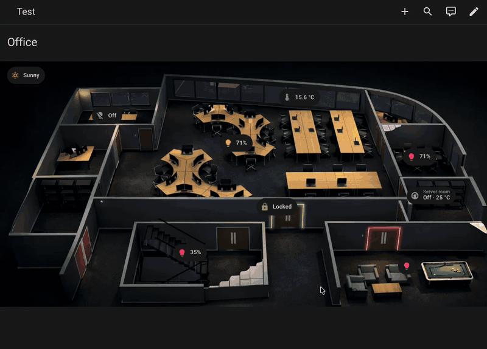
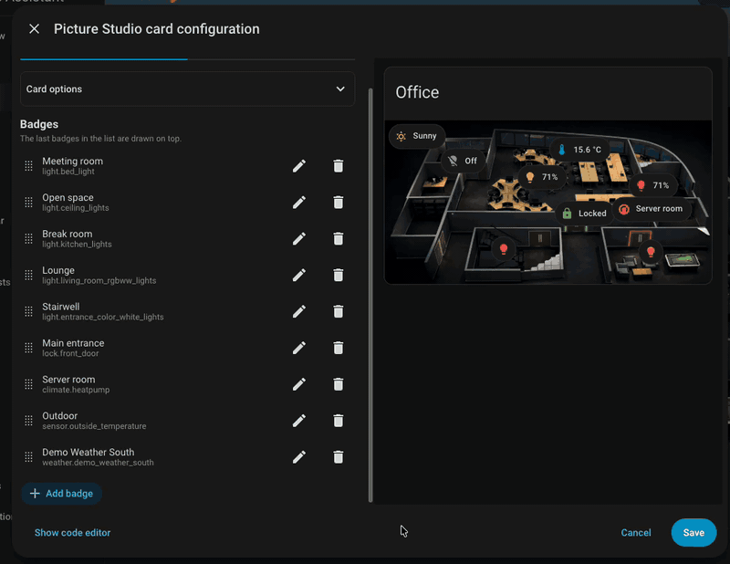

# Picture Studio

**Put badges and icons on a picture and drag them where they belong — right in the card editor, without writing a line of YAML.**

A floor plan, a photo, a camera view: pick an image, drop items on it, and place them with the mouse on the live preview. What you drag is what you get.

## The editor


## Badges

Once saved, they behave like anything else in Lovelace: tap one to toggle it, or open its more-info dialog.



## Custom badges

Badges from other frontend plugins appear in the picker next to the built-in ones and render on the image just the same. That is the main reason this card exists.



## Elements

A badge carries a pill, a label and one fixed size. When what you want on the
plan is something else, add an **element** item instead: the same entity, name
and colour controls, without the pill.

Two kinds are available: a **state icon** that reflects an entity's icon and
colour, and a **state label** that places the entity's name, state, or both as
text on the picture.

You choose [how big each is](#element-size) and [what it stands on](#appearance).

## Install

### Requirements

**Home Assistant 2026.6.0 or newer.** HACS enforces this and will refuse to install on an older version.

### HACS

[](https://my.home-assistant.io/redirect/hacs_repository/?owner=lalexdotcom&repository=picture-studio-card&category=plugin)

Picture Studio is **not** in the default HACS catalog, so it has to be added as a custom repository. The button above does exactly that: HACS asks you to confirm, adds the repository, and opens its page. From there:

1. Choose **Download**.
2. Reload Home Assistant.
3. Hard-refresh your browser — **Ctrl + F5** on Windows/Linux, **Cmd + Shift + R** on Mac.

<details>
<summary>If the button does not work</summary>

HACS may not be installed yet, or your instance URL may not be registered with My Home Assistant. Add the repository by hand:

1. Open **HACS** in Home Assistant.
2. Open the **⋮** menu → **Custom repositories**.
3. Repository: `lalexdotcom/picture-studio-card` — Type: **Dashboard**.
4. **Add**, then open **Picture Studio** from the list, and download it as above.

One other case needs a manual step: a dashboard in YAML mode, where HACS cannot touch the resource list and says so. Add the resource yourself as described under **Manual install**, with `/hacsfiles/picture-studio-card/picture-studio.js` as the URL.

</details>

<details>
<summary>Manual install</summary>

1. Download `picture-studio.js` from the [latest release](https://github.com/lalexdotcom/picture-studio-card/releases/latest).
2. Copy it into your Home Assistant `www` directory — `config/www/picture-studio.js`. Create `www` if it does not exist.
3. Add it as a dashboard resource, in **Settings → Dashboards → ⋮ → Resources → Add resource**:
   ```yaml
   url: /local/picture-studio.js
   type: module
   ```
   In YAML mode, put the same two keys under `lovelace: resources:` in `configuration.yaml` instead.
4. Reload Home Assistant, then hard-refresh your browser.

Updating means repeating steps 1 and 2, then hard-refreshing. Appending a query string to the resource URL — `/local/picture-studio.js?v=2` — is the reliable way to defeat browser caching.

</details>

### Add the card

1. Edit your dashboard.
2. **Add card**.
3. Search for **Picture Studio**.
4. Pick the background image.
5. Add badges or icons, then drag them onto the image in the preview.
6. **Save**.

## Configuration

### Size and position

#### Anchor

An item's position is a pair of percentages, and the anchor decides which part of
the item they place.

- **Automatic** *(default)* — the anchor follows the coordinate.
- **Anchored** — the coordinates place the point you pick in the grid.

#### Element size

An element's size follows the **card**, not the screen: in a sections view a
narrow column gives a smaller element than a wide one, and the same card on a
phone scales down with it. Three modes decide how closely:

- **Automatic** *(default)*
- **Adaptive** — your own ratio, between your own bounds.
- **Fixed** — one size in pixels, which follows nothing.

An icon's size is the box that contains it. A label's size is its font size —
the box is as wide as the text.

### Appearance

A **halo** lifts an element off the picture with a faint white rim and a soft
shadow behind it. It is off by default — tick **Stand out** in an item's
Appearance section to add it. The checkbox is available on both icons and labels.

A **chrome** surrounds an item with its own surface.

- **Theme** — **Auto**, **Light** or **Dark**.
- **Radius** — rounded corners. For an icon: a percentage of its box. For a
  label: pixels.
- **Opacity** — fades the surface alone.
- **Content** — how much of the surface an icon's glyph takes.
- **Pill** (label only) — fully rounded ends, regardless of the box's width.
- **Padding** (label only) — the gutter between the text and the surface edge.

### YAML reference

```yaml
type: custom:picture-studio
# One of image, image_entity or camera_image is required
image: /local/floorplan.png
image_entity: image.floorplan      # optional, an image or person entity instead of image
camera_image: camera.front_door   # optional, instead of image
camera_view: auto                  # optional: "auto" | "live"
entity: light.living_room          # optional — required for state_image / state_filter
state_image:                       # optional: entity-state → image URL map (needs entity)
  "on": /local/on.png
  "off": /local/off.png
state_filter:                      # optional: entity-state → CSS filter map (needs entity)
  "off": brightness(0.5)
dark_mode_image: /local/floorplan-dark.png   # optional
dark_mode_filter: brightness(0.7)  # optional CSS filter applied in dark mode
aspect_ratio: "16:9"               # optional, e.g. "16:9" or "1:1"
filter: brightness(0.9)            # optional CSS filter
title: My floorplan                # optional card header
items:
  - type: badge                  # family discriminant; required
    config:
      type: entity               # any Lovelace badge config
      entity: sensor.temperature
    position:
      top: 30%
      left: 60%
    anchor: center               # optional; defaults to "auto"
    visibility:                  # optional; absent or empty means always drawn
      - condition: state
        entity: input_boolean.show_badge
        state: "on"

  - type: element
    config:
      type: state-icon
      entity: light.salon
      icon: mdi:floor-lamp       # optional; the entity's state icon otherwise
      color: state               # state | none | a theme colour name
      name: Lampe du salon       # optional; shown as a tooltip
      show_entity_picture: false
      tap_action: { action: more-info }
      size:
        mode: auto               # auto | adaptive | fixed (absent => auto)
        ratio: 8                 # adaptive only — % of card width
        min: 24                  # adaptive only — px
        max: 48                  # adaptive only — px
        value: 48                # fixed only — px
      halo: false                # optional; absent means no halo
      chrome:                    # optional; absent means no chrome
        theme: none              # none | auto | light | dark
        radius: 50               # % of the box — 50 is a disc, 0 a square
        opacity: 1               # the surface's opacity, 0-1
        content_ratio: 0.6       # share of the box taken by the icon, 0-1
    position:
      top: 45%
      left: 20%

  - type: element
    config:
      type: state-label
      entity: sensor.temperature
      show_name: false           # optional; default false
      show_state: true           # optional; default false
      name: ___device_name___    # optional; composed sentinels or plain text
      color: none                # state | none | a theme colour name
      state_content: state       # optional; string or list of strings
      time_format: "24"          # optional; only when state_content carries a time
      tap_action: { action: more-info }
      size:
        mode: auto               # auto | adaptive | fixed (absent => auto)
        ratio: 3                 # adaptive only — % of card width
        min: 11                  # adaptive only — px
        max: 20                  # adaptive only — px
        value: 14                # fixed only — px
      halo: false                # optional; absent means no halo
      chrome:                    # optional; absent means no chrome
        theme: none              # none | auto | light | dark
        radius: 8                # px — border-radius (ignored when pill: true)
        pill: false              # fully rounded ends
        opacity: 1               # the surface's opacity, 0-1
        padding: 6               # px — gutter between text and surface edge
    position:
      top: 50%
      left: 30%
```

`image` and `dark_mode_image` accept a plain path written by hand, or the object the editor's media picker stores once you browse or upload a picture:

```yaml
image:
  media_content_id: media-source://media_source/local/floorplan.png
  media_content_type: image/png
```

Both forms render identically; the editor displays either one.

#### Positions, anchors and sizes

An element's `size.mode` is `auto`, `adaptive` or `fixed` — the three choices
the editor offers. `adaptive` reads `min`, `ratio` and `max`, `fixed` reads
`value`, and the numbers a mode does not use are kept as you left them.

For a **state icon**, `auto` is `ratio: 8`, `min: 24` and `max: 48` — 8% of
the card's width, never under 24px and never over 48px. For a **state label**,
`auto` is `ratio: 3`, `min: 11` and `max: 20` — 3% of the card's width, never
under 11px and never over 20px. An icon's size is the box; a label's is the
font size.

`top` and `left` accept `30%` or a bare `30`. The editor writes the percent form
back and keeps two decimals, which is the precision dragging produces.

`anchor` is `auto` — the **Automatic** switch in the editor — or one of the
nine fixed points: `top-left`, `top-center`, `top-right`, `center-left`,
`center`, `center-right`, `bottom-left`, `bottom-center`, `bottom-right`. An
absent `anchor` means `auto`. The value `proportional` is still read, for
configs written before 1.2.0, and normalises to `auto`.

Coordinates outside `0-100` are allowed and kept as written: under a fixed anchor
they are how you place an item deliberately over the edge. Dragging never creates
an overflow and never worsens one — an item already hanging off the edge can be
pulled back in but not pushed further out, and once fully inside it stays there.

#### Which item is on top

Items overlap in the order `items` gives them: **the last one in the YAML is
drawn over the others**. There is no `z-index` to set.

#### Visibility

Every item takes an optional `visibility` list. The conditions are Home
Assistant's own — entity state, numeric state, screen size, time, user, zone,
and the `and` / `or` / `not` combinators — the same ones a card or a badge
accepts. The item is drawn when every entry in the list is met; an absent or
empty list means always drawn.

In the editor, items carrying conditions are marked in the preview, and each
item's form has a "Visibility" section with Home Assistant's condition editor
and its live "current visibility" banner.

The card's own visibility is native to Home Assistant and needs nothing from
this card: the Lovelace engine evaluates `config.visibility` on every card,
and the edit dialog's "Visibility" tab is generic to all cards.

#### Appearance keys

Anything drawn on a photograph competes with whatever the picture happens to
show. `halo` adds a white rim and a soft shadow so the element lifts off the
picture — absent or `false` means no halo. `chrome` gives an item a surface to
stand on instead. Both keys belong to the item rather than one kind of item, and
both are off by default.

`theme` is the switch as well as the choice. `none` — the default, and what an
absent `chrome` means — draws nothing. `auto` uses the same background your
dashboard's cards use, so the surface follows your theme. `light` and `dark`
force one or the other, which is what you want when the picture is dark and the
theme is not, or the reverse.

`opacity` fades the surface only — the content keeps its own colour.

**Icon chrome** (`type: state-icon`): `radius` is a percentage of the box —
`50` is a disc, `0` a square, anything between a rounded square.
`content_ratio` is the share of the box the glyph takes: `0.6` matches Home
Assistant's own icons, and `1` fills the box entirely, which turns the chrome
into a frame around an entity picture rather than a disc behind it.

**Label chrome** (`type: state-label`): `radius` is in pixels — a percentage
would draw an ellipse on a wide text box rather than a rounded corner.
`pill: true` overrides `radius` with fully rounded ends, and is why enabling it
hides the radius control in the editor. `padding` is the gutter between the
text and the surface edge, in pixels.

The numbers are kept when you switch the surface back to `none`, so trying a
chrome out and turning it off costs you nothing.

Note that for an icon, `size` is the size of the whole thing: switching a chrome
on does not make the item bigger, it makes what is inside it smaller. For a
label the chrome widens the item — the text box belongs to the text, and the
surface grows around it.

#### CSS tokens

Both element kinds expose CSS custom properties you can override in your
dashboard's card or theme.

**State icon** (`type: state-icon`):

| Token | Default | What it controls |
|---|---|---|
| `--psc-icon-size` | set by the card | The icon's box size, as the `size` mode produces it |
| `--psc-icon-outline` | `0 0 1px rgba(255,255,255,0.4)` | The white rim in the halo filter |
| `--psc-icon-glow` | `0 0 calc(size × 0.06) rgba(0,0,0,0.2)` | The dark shadow in the halo filter |

**State label** (`type: state-label`):

| Token | Default | What it controls |
|---|---|---|
| `--psc-label-size` | set by the card | The label's font size, as the `size` mode produces it |
| `--psc-label-outline` | `0 0 1px rgba(255,255,255,0.4)` | The white rim in the halo filter |
| `--psc-label-glow` | `0 0 calc(size × 0.06) rgba(0,0,0,0.2)` | The dark shadow in the halo filter |

The state value inside a label uses the font weight `--ha-font-weight-medium`
(500), which is Home Assistant's own token for the weight it gives a badge's
state. A theme that redefines that token carries the label with it.

The glow and outline tokens are `drop-shadow()` values used inside a CSS
`filter:`. Setting one on the element's host tag or any ancestor overrides the
default for that element. `--psc-icon-size` and `--psc-label-size` are written
by the card and can be read by custom CSS.

**Both kinds**, for the hover:

| Token | Default | What it controls |
|---|---|---|
| `--psc-hover-opacity` | `0.04` | How much of its colour an item on a surface takes under the mouse |
| `--psc-pressed-opacity` | `0.12` | The same, while the pointer is held down |
| `--psc-item-color` | the item's own colour | What the hover tints with; falls back to the inactive grey when the item names no colour |

#### What an item does under the mouse

Only an item you can click reacts — one that has at least one action, which is
every item unless you set tap, hold and double tap all to **No action**.

What it does depends on whether it stands on a surface. **With a surface**, the
surface takes a veil of the item's own colour — the same 4% Home Assistant gives
a badge, 12% while you hold the pointer down. **Without a surface**, there is
nothing to tint: a glyph or a line of text sits directly on the photograph,
where a 4% veil would be invisible. So the item grows by 8% instead.

Nothing reacts while you are editing the card: the whole picture belongs to
placing items there.

#### YAML-only keys

The editor covers the keys you set every day: title, image, dark mode image, camera entity, camera view, state filter and dark mode filter. `entity`, `image_entity`, `state_image`, `aspect_ratio` and `filter` are set in YAML only. Field labels follow your Home Assistant interface language.

#### Card size

The card sizes itself to the image by default. If you resize it to a height the image does not fit, the image keeps its proportions and the part that no longer fits stays reachable by scrolling the card.

## Roadmap

Icons arrived in 1.2.0 and text labels in 1.4.0. Later versions will place more kinds of content on the image — buttons — drawn to sit alongside today's Home Assistant cards rather than to reproduce anything older.

## Development

### Prerequisites

- Node.js `^20.19.0 || >=22.12.0`
- pnpm
- Docker (Docker-in-Docker is supported in the devcontainer)

### Start the dev build watcher

```bash
pnpm dev
```

### Start the local Home Assistant instance

```bash
pnpm run ha:up
```

The container mounts `dist/` into Home Assistant's `/config/www/picture-studio-card/`, so every build is immediately served at:

```
http://localhost:8123/local/picture-studio-card/picture-studio.js
```

Port 8123 is forwarded by the devcontainer (`forwardPorts`). If it is not forwarded automatically, forward it manually from the Ports panel.

### Register the Lovelace resource (one-time manual step)

1. Open <http://localhost:8123> and complete the onboarding wizard to create your account.
2. Go to **Settings → Dashboards → ⋮ → Resources → Add resource**.
3. URL: `/local/picture-studio-card/picture-studio.js?v=1` — Type: **JavaScript module**.
4. Reload the page.

This step persists in the `.ha/config` volume and only needs to be done once.

### Cache busting

If HA serves a stale bundle after a rebuild, increment the `?v=` query parameter in the resource URL and reload.

### Other commands

```bash
pnpm run ha:logs   # follow Home Assistant logs
pnpm run ha:down   # stop the container
pnpm build         # production build into dist/
pnpm test          # run the test suite (src/tests/)
pnpm lint          # Biome check
pnpm format        # Biome check --write
pnpm typecheck     # tsc --noEmit
```
